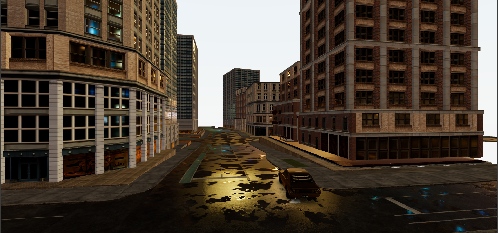

# Racing Game — 3D demo (React + Vite + three.js)

A small 3D racing demo built with React, Vite and Three.js using @react-three/fiber. The project features a city environment, HDRI lighting, a controllable car and a dynamic camera.

This README explains how to run, build and extend the project locally (Windows / PowerShell instructions included).

## Highlights

- Real-time 3D rendering using three.js and @react-three/fiber
- Environment HDRI lighting and realistic sky (via `drei` and HDRI in `public/hdri`)
- Dynamic camera system and car controls (see `src/Car.jsx`)
- Lightweight dev workflow with Vite (fast HMR)

## Tech stack

- React 19
- Vite
- three (three.js)
- @react-three/fiber
- @react-three/drei
- @react-three/postprocessing

Key files

- `src/App.jsx` — app entry, Canvas and scene composition
- `src/Car.jsx` — car model + controls and camera interaction
- `src/CityModel.jsx` — city models and scene geometry
- `public/hdri/night_city_4k.hdr`, `public/models`, `public/textures` — assets

## Prerequisites

- Node.js (recommended 16+)
- npm (or yarn/pnpm if you prefer; commands below use npm)

## Install

Open PowerShell in the project root and run:

```powershell
npm install
```

## Development (local)

Start the dev server (Vite with HMR):

```powershell
npm run dev
```

Then open the URL printed by Vite (usually http://localhost:5173).

## Build & Preview

Build a production bundle:

```powershell
npm run build
```

Preview the production build locally:

```powershell
npm run preview
```

## Linting

Run ESLint across the project source:

```powershell
npm run lint
```

## Project structure (important paths)

- `src/` — React components and app logic
- `public/hdri/` — HDRI environment maps
- `public/fonts/` — font assets used by the scene
- `public/models/` — 3D model files

If you add assets, keep them under `public/` so Vite serves them statically at the root (e.g. `/hdri/night_city_4k.hdr`).

## How it works (short)

The app mounts a `Canvas` from `@react-three/fiber` (see `src/App.jsx`) and composes the scene with:

- `Sky` and `Environment` from `drei` for lighting and backgrounds
- A `CityModel` that places the level geometry and props
- A `Car` component which implements controls and camera following

The camera is created in `App.jsx` (a `PerspectiveCamera`) and passed to `Car` via `cameraRef` so the car can control the view.

## Status

This project is currently in active development — "building" phase. There are working scene components (city, car, HDRI lighting) but more polish, performance tuning and assets may be added before a stable release. Expect changes to scene layout, controls and asset paths while development continues.

## Screenshot

Below is an in-engine screenshot preview.


## Troubleshooting

- Blank screen or missing models: check the browser console for 404s — confirm assets exist under `public/` and paths match (e.g. `/hdri/night_city_4k.hdr`).
- Performance issues: lower device pixel ratio (in `Canvas dpr`), reduce texture sizes or use smaller HDRI maps.
- Dev server not starting: verify Node/npm versions and that another process isn't using the port. To change Vite port, set `--port` or set `VITE_PORT` env.

## Contributing

Contributions are welcome. Good small first tasks:

- Add comments to `src/Car.jsx` explaining control mapping
- Add more levels or props to `src/CityModel.jsx`
- Improve README with screenshots or a short GIF

When contributing, please open a PR and describe the change.

## Credits & Licenses

- Built with three.js, @react-three/fiber and @react-three/drei
- HDRI and other third-party assets should be attributed in this section if you include them from external sources. Currently the repo includes `public/hdri/night_city_4k.hdr` and font assets in `public/fonts/`.

## License

Add a `LICENSE` file to this repository with your chosen license. If you want a permissive option, consider the MIT license.

---
